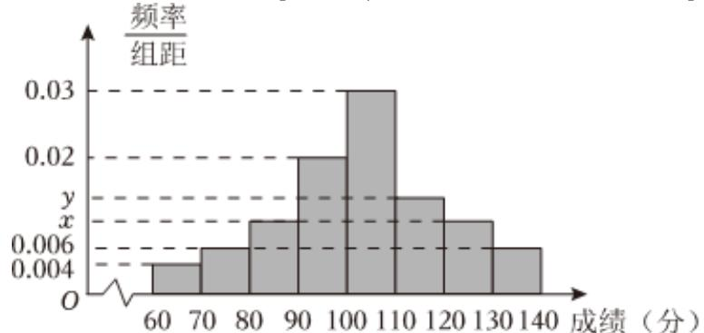

<!-- question-source:start -->
2、上饶某中学为了解该校高三年级学生数学学习情况，对一模考试数学成绩进行分析，从中抽取了50名学生的成绩作为样本进行统计（若该校全体学生的成绩均在[60,140)分，按照[60,70)，[70,80)，[80,90)，[90,100)，[100,110)，[110,120)，[120,130)，[130,140)的分组作出频率分布直方图如图(a)所示，若用分层抽样从分数在[70,90)内抽取8人，则抽得分数在[70,80)的人数为3人.

(1)求频率分布直方图中的 $x$ ， $y$ 的值；并估计本次考试成绩的平均数（以每一组的中间值为估算值）；

(2)该高三数学组准备选取数学成绩在前 $5\%$ 的学生进行培优指导，若小明此次数学分数是132，请你估算他能被选取吗？
<!-- question-source:end -->

![[Q00092191A1]]
