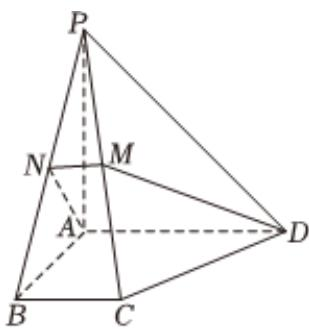

<!-- question-source:start -->
4、如图，在四棱锥 $P - ABCD$ 中，底面为直角梯形， $AD \parallel BC, \angle BAD = 90^{\circ}$ ， $PA \perp$ 底面 $ABCD$ ，且 $PA = AD = AB = 2BC$ ， $M$ 、 $N$ 分别为 $PC$ 、 $PB$ 的中点.

(I)求证： $PB \perp DM$ ;

(Ⅱ)求BD与平面ADMN所成的角.

<!-- question-source:end -->

![[Q00092193A1]]
