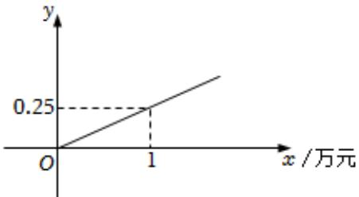
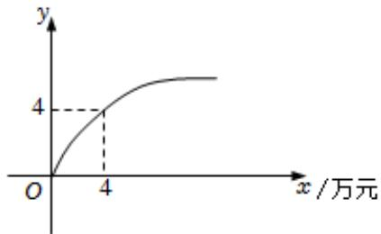

<!-- question-source:start -->
5、某企业生产 $A$ ， $B$ 两种产品，根据市场调查与预测， $A$ 产品的利润 $y$ 与投资 $x$ 成正比，其关系如图（1）所示； $B$ 产品的利润 $y$ 与投资 $x$ 的算术平方根成正比，其关系如图（2）所示（注：利润 $y$ 与投资 $x$ 的单位均为万元）。

(1)分别求 $A$ ， $B$ 两种产品的利润 $\pmb{y}$ 关于投资 $\pmb{x}$ 的函数解析式；

(2)已知该企业已筹集到200万元资金，并将全部投入A，B两种产品的生产.

①若将200万元资金平均投入两种产品的生产，可获得总利润多少万元？

②如果你是厂长，怎样分配这200万元资金，可使该企业获得的总利润最大？其最大利润为多少万元？

  
图（1）

  
图（2）
<!-- question-source:end -->

![[Q00092194A1]]
