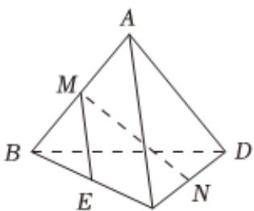

> [!faq]- 2022-2023学年内蒙古赤峰市松山区赤峰红旗中学高一（下）期末数学试卷解析
>
> > [!success]- **【答案】** D
>
> > [!note]- **【解析】**
> > 取 $BC$ 的中点 $\pmb{E}$ ，分别连接 $ME, NE,$
> >
> > 因为M，N分别为AB，CD的中点，可得 $ME \parallel AC, NE \parallel BD$ ，
> >
> > 所以异面直线MN与BD所成角，即为直线MN与NE所成角，即为∠MNE或其补角，
> >
> > 因为 $AC = 2$ ， $BD = 2\sqrt{2}$ ，所以 $ME = 1$ ， $NE = \sqrt{2}$
> >
> > 在 $\triangle MNE$ 中，因为 $ME = 1$ ， $NE = \sqrt{2}$ 且 $MN = 2$
> >
> > 
> >
> > $$
> > \cos \angle M N E = \frac {E N ^ {2} + M N ^ {2} - M E ^ {2}}{2 \times E N \times M N} = \frac {2 + 4 - 1}{2 \sqrt {2} \times 2} = \frac {5 \sqrt {2}}{8}
> > $$
> >
> > 即异面直线MN与BD所成角的余弦值为 $\frac{5\sqrt{2}}{8}$ .
> >
> > 故选：D.
