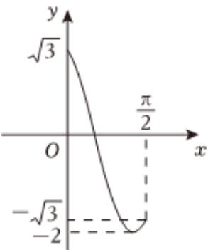

> [!faq]- 2022-2023学年内蒙古赤峰市松山区赤峰红旗中学高一（下）期末数学试卷解析
>
> > [!success]- **【答案】** BCD
>
> > [!note]- **【解析】**
> > 由函数 $f(x)=A\sin(\omega x+\varphi)$ 在一个周期内的图象知，
> >
> > $$
> > A = 2, \frac {T}{2} = \frac {5 \pi}{1 2} - (- \frac {\pi}{1 2}) = \frac {\pi}{2}
> > $$
> >
> > 所以 $T=\pi,\omega=\frac{2\pi}{T}=2$
> >
> > 所以 $f(x)=2\sin(2x+\varphi)$
> >
> > 将点 $(- \frac{\pi}{12}, 2)$ 代入 $f(x)$ 的解析式，得 $2 = 2sin\left(-\frac{\pi}{6} + \varphi\right)$ ，即
> >
> > $$
> > \sin \left(- \frac {\pi}{6} + \varphi\right) = 1
> > $$
> >
> > 
> >
> > 所以 $-\frac{\pi}{6} + \varphi = \frac{\pi}{2} + 2k\pi, k \in Z$
> >
> > 因为 $|\varphi| < \pi$ ，所以 $\varphi = \frac{2\pi}{3}$ ，所以 $f(x) = 2sin(2x + \frac{2\pi}{3})$ ，选项 $A$ 错误；
> >
> > $f(-\frac{\pi}{3}) = 2sin[2(-\frac{\pi}{3}) + \frac{2\pi}{3}] = 2sin0 = 0$ ，所以函数 $f(x)$ 的图象关于点 $(- \frac{\pi}{3}, 0)$ 对称，选项 $B$ 正
> >
> > $f(-\frac{7\pi}{12}) = 2sin[2(-\frac{7\pi}{12}) + \frac{2\pi}{3}] = 2sin(-\frac{\pi}{2}) = -2$ ，所以 $f(x)$ 的图象对称轴为直线 $x = -\frac{7\pi}{12}$
> >
> > 当 $x \in [0, \frac{\pi}{2}]$ 时， $2x + \frac{2\pi}{3} \in [\frac{2\pi}{3}, \frac{5\pi}{3}]$ ，又 $f(0) = 2\sin \frac{2\pi}{3} = \sqrt{3}$ ，
> >
> > $$
> > f \left(\frac {\pi}{2}\right) = 2 \sin \left(2 \times \frac {\pi}{2} + \frac {2 \pi}{3}\right) = 2 \sin \frac {5 \pi}{3} = - \sqrt {3},
> > $$
> >
> > 所以 $f(x)$ 的最小值是 $f(\frac{5\pi}{12}) = 2\sin (2\times \frac{5\pi}{12} +\frac{2\pi}{3}) = -2$
> >
> > 画出 $f(x)$ 在 $[0, \frac{\pi}{2}]$ 上的大致图象为：
> >
> > 若方程 $f(x) = m$ 在 $[0, \frac{\pi}{2}]$ 上有两个不相等的实数根，则 $m$ 的取值范围是 $(-2, -\sqrt{3}]$ ，选项 $D$ 正确。故选： $BCD$ 。
