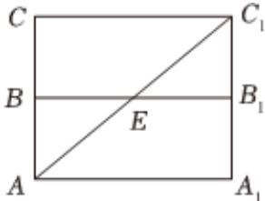
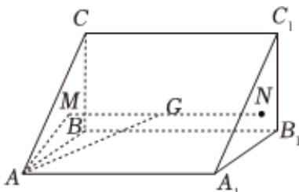

> [!faq]- 2022-2023学年内蒙古赤峰市松山区赤峰红旗中学高一（下）期末数学试卷解析
>
> > [!success]- **【答案】** ACD
>
> > [!note]- **【解析】**
> > 对于A，因为在直三棱柱 $ABC-A_{1}B_{1}C_{1}$ 中， $AA_{1}=2$ ，AB=BC=1， $\angle ABC=60^{\circ}$ ，所以直棱柱的体积为 $S_{\triangle ABC}\cdot AA_{1}=\frac{1}{2}\times1\times1\times\sin60^{\circ}\times2=\frac{\sqrt{3}}{2}$ ，所以A正确；对于B，将直棱柱的两个侧面 $AA_{1}B_{1}B$ 和 $CC_{1}B_{1}B$ 展在同一个平面，如图所示，
> >
> > 
> >
> > 则 $AE + EC_1$ 的最小值为 $AC_{1} = \sqrt{A_{1}A^{2} + A_{1}C_{1}^{2}} = \sqrt{4 + 4} = 2\sqrt{2}$ ，所以 $B$ 错误；
> >
> > 对于 $C$ ，由题意可知 $\triangle ABC$ ， $\triangle A_{1}B_{1}C_{1}$ 为边长为1的等边三角形，
> >
> > 设 $\triangle ABC$ ， $\triangle A_{1}B_{1}C_{1}$ 的中心分别为 $M$ ， $N$ ，连接 $MN$ ，设 $MN$ 的中点 $G$
> >
> > 则点G为直三棱柱ABC-A\_{1}B\_{1}C\_{1}外接球的球心，
> >
> > 连接 $AG$ ， $AM$ ，则 $AM = \frac{2}{3} \times \frac{\sqrt{3}}{2} \times 1 = \frac{\sqrt{3}}{3}$ ，所以
> >
> > $$
> > A G = \sqrt {A M ^ {2} + M G ^ {2}} = \sqrt {\frac {3}{9} + 1} = \frac {2 \sqrt {3}}{3}
> > $$
> >
> > 所以直三棱柱 $ABC - A_{1}B_{1}C_{1}$ 外接球的表面积为 $4\pi \bullet AG^{2} = 4\pi \times \frac{12}{9} = \frac{16\pi}{3}$ ，所以 $C$ 正确；
> >
> > 
> >
> > 对于D，因为 $B_{1}B\parallel AA_{1}$ ， $B_{1}B\notin$ 平面 $AA_{1}O$ ， $AA_{1}\subset$ 平面 $AA_{1}O$ ，所以 $B_{1}B\parallel$ 平面 $AA_{1}O$ ，又点E是侧棱 $BB_{1}$ 上的一个动点，
> >
> > 所以点E到平面 $AA_{1}O$ 的距离为定值，又 $\triangle AA_{1}O$ 的面积为定值，
> >
> > 所以三棱锥 $E - AA_{1}O$ 的体积与点 $E$ 的位置无关，所以 $D$ 正确.
> >
> > 故选：ACD.
