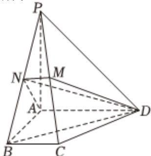

> [!faq]- 2022-2023学年内蒙古赤峰市松山区赤峰红旗中学高一（下）期末数学试卷解析
>
> > [!success]- **【答案】** 详见解析
>
> > [!note]- **【解析】**
> > 详见解析
> >
> > 方法一：
> >
> > (I)因为N是PB的中点，PA=AB，
> >
> > 所以 $AN \perp PB$ .
> >
> > 
> >
> > 因为 $AD \perp$ 面PAB，
> >
> > 所以 $AD \perp PB$ .
> >
> > 从而 $PB \perp$ 平面ADMN.因为DM⊂平面ADMN
> >
> > 所以 $PB \perp DM$ .
> >
> > (Ⅱ)连接DN，
> >
> > 因为 $PB \perp$ 平面ADMN，
> >
> > 所以 $\angle BDN$ 是 $BD$ 与平面ADMN所成的角.
> >
> > 在 $Rt\triangle BDN$ 中， $\sin \angle BDN = \frac{BN}{BD} = \frac{1}{2}$
> >
> > 故BD与平面ADMN所成的角是 $\frac{\pi}{6}$ .
> >
> > ## 方法二：
> >
> > 如图，以A为坐标原点建立空间直角坐标系A-xyz，设BC=1，
> >
> > 则 $A(0,0,0)P(0,0,2),B(2,0,0),M(1,12,1),D(0,2,0)$
> >
> > (I)因为 $\overrightarrow{PB} \bullet \overrightarrow{DM} = (2, 0, -2)(1, -\frac{3}{2}, 1) = 0$
> >
> > 所以 $PB \perp DM$ .
> >
> > (Ⅱ)因为 $\overrightarrow{PB} \bullet \overrightarrow{AD} = (2, 0, -2) \bullet (0, 2, 0) = 0$
> >
> > 所以 $PB \perp AD$ .
> >
> > $$
> > P B \bot D M.
> > $$
> >
> > 因此 $< \overrightarrow{PB},\overrightarrow{AD}>$ 的余角即是BD与平面ADMN所成的角.
> >
> > 因为 $\cos <\overrightarrow{PB},\overrightarrow{AD}>=\frac{1}{2}$
> >
> > 所以 $< \overrightarrow{PB},\overrightarrow{AD} > = \frac{\pi}{3}$
> >
> > 因此BD与平面ADMN所成的角为 $\frac{\pi}{6}$ .
