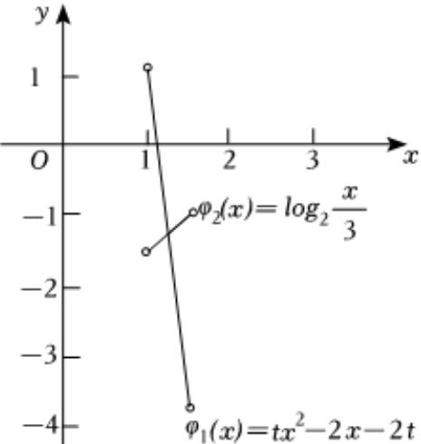

> [!faq]- 2022-2023学年内蒙古赤峰市松山区赤峰红旗中学高一（下）期末数学试卷解析
>
> > [!success]- **【答案】** 详见解析
>
> > [!note]- **【解析】**
> > 详见解析
> >
> > (I)因为函数 $h(x)=x^{2}+bx+c$ 是偶函数，故b=0
> >
> > 而 $h(-1)=1+c=0$ ，可得c=-1，
> >
> > 则 $h(x) = x^2 - 1$ ，故 $f(x) = \frac{h(x)}{x} = x - \frac{1}{x}$ ，
> >
> > 易知 $f(x) = x - \frac{1}{x}$ 在 $x \in [1,2]$ 上单调递增，故 $f(x)_{\min} = f(1) = 0$ ， $f(x)_{\max} = f(2) = \frac{3}{2}$ ，
> >
> > 故 $f(x) \in [0, \frac{3}{2}]$ .
> >
> > $$
> > ) F (x) = x ^ {2} + \frac {1}{x ^ {2}} - 2 a (x - \frac {1}{x}) = (x - \frac {1}{x}) ^ {2} - 2 a (x - \frac {1}{x}) + 2, x \in [ 1, 2 ]
> > $$
> >
> > 令 $m=x-\frac{1}{x}$ ， $x\in[1,2]$ ，故 $m\in[0,\frac{3}{2}]$ ，
> >
> > 则 $F(m) = m^2 - 2am + 2, m \in [0, \frac{3}{2}]$ ，对称轴为 $m = a$
> >
> > ①当 $a \leqslant 0$ 时， $F(m) = m^2 - 2am + 2$ 在 $m \in [0, \frac{3}{2}]$ 上单增，故 $F(m)_{\min} = F(0) = 2$ ；
> >
> > ②当 $a\in[0,\frac{3}{2}]$ ，时， $F(m)=m^{2}-2am+2$ 在 $m\in[0,a)$ 上单减，在 $(a,\frac{3}{2}]$ 上单增，故 $F(m)_{\min}=F(a)=2-a^{2}$ ;
> >
> > ③当 $a \geqslant \frac{3}{2}$ 时， $F(m) = m^2 - 2am + 2$ ，在 $m \in [0, \frac{3}{2}]$ 上单减，故 $F(m)_{\min} = F(\frac{3}{2}) = \frac{17}{4} - 3a$
> >
> > 故函数 $F(m)$ 的最小值 $g(a)=\left\{\begin{aligned}&2,a\leq0\\&2-a^{2},0<a<\frac{3}{2}\\&\frac{17}{4}-3a,a\geq\frac{3}{2}\end{aligned}\right.$
> >
> > (Ⅲ) 由(Ⅱ)知当 $a \in (1, \frac{3}{2})$ 时， $g(a) = 2 - a^2$ ，
> >
> > 则 $G(a) = \log_2\frac{a}{3} + 2a + tg(a) = \log_2\frac{a}{3} + 2a + 2t - ta^2 = 0$ ，即 $ta^2 - 2a - 2t = \log_2\frac{a}{3}$
> >
> > 令 $\varphi_{1}(x) = tx^{2} - 2x - 2t$ ， $\varphi_{2}(x) = \log_{2}\frac{x}{3}$ ， $x\in (1,\frac{3}{2})$
> >
> > 问题等价于两个函数 $\varphi_{1}(x)$ 与 $\varphi_{2}(x)$ 的图象在 $x\in (1,\frac{3}{2})$ 上有且只有一个交点；
> >
> > 由 $t < 0$ ，函数 $\varphi_{1}(x) = tx^{2} - 2x - 2t$ 的图象开口向下，对称轴为 $x = \frac{1}{t} < 0$
> >
> > $\varphi_{1}(x)$ 在 $x\in (1,\frac{3}{2})$ 上单调递减， $\varphi_{2}(x)$ 在 $x\in (1,\frac{3}{2})$ 上单调递增，大致草图如图所示：
> >
> > 
> >
> > 故 $\left\{\begin{aligned}\varphi_{1}(1)>\varphi_{2}(1)\\ \varphi_{1}\left(\frac{3}{2}\right)<\varphi_{2}\left(\frac{3}{2}\right)\end{aligned}\right.$ ，即 $\left\{\begin{aligned}-2-t>log_{2}\frac{1}{3}\\ \frac{t}{4}-3<log_{2}\frac{1}{2}\end{aligned}\right.$ ，解得 $t<\log_{2}3-2$ ，
> >
> > 故 $t\in(-\infty,\log_{2}3-2)$ .
