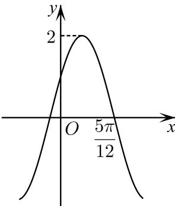

<!-- question-source:start -->
11. 若函数 $f(x) = A\sin (2x + \varphi)\left(A > 0, 0 < \varphi < \frac{\pi}{2}\right)$ 的部分图像如图所示，则下列叙述正确的是（）

A. $f(x)$ 的最小正周期为 $\pi$ B. 函数 $f(x)$ 的图象关于直线 $x = \frac{\pi}{3}$ 对称  
C. $f\left(\frac{\pi}{6}\right) = 2$ D. $\left(-\frac{\pi}{12}, 0\right)$ 是函数 $f(x)$ 图象的一个对称中心
<!-- question-source:end -->

![[Q00092668A1]]
