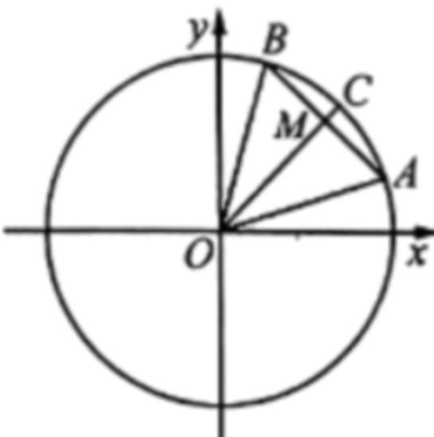

<!-- question-source:start -->
12. 如图所示，已知角 $\alpha, \beta \left(0 < \alpha < \beta < \frac{\pi}{2}\right)$ 的始边为 $x$ 轴的非负半轴，终边与单位圆的交点分别为 $A, B$ ， $M$ 为线段 $AB$ 的中点，射线 $OM$ 与单位圆交于点 $C$ ，则（）

A. $\angle AOB = \beta -\alpha$ B. $|OM| = \cos {\frac{\beta - \alpha}{2}}$

C. 点 $C$ 的坐标为

$$
\left(\cos \frac {\alpha + \beta}{2}, \sin \frac {\alpha + \beta}{2}\right)
$$

D. 点 $M$ 的坐标为

$$
\left(\cos \frac {\alpha + \beta}{2} \cos \frac {\beta - \alpha}{2}, \sin \frac {\alpha + \beta}{2} \sin \frac {\beta - \alpha}{2}\right)
$$
<!-- question-source:end -->

![[Q00092669A1]]
