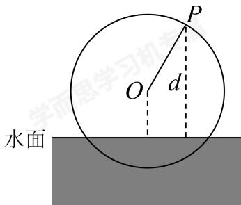

<!-- question-source:start -->
21. 如图, 一个半径为5米的筒车按逆时针每分钟转2圈, 筒车的轴心 $O$ 距离水面的高度为2.5米. 设筒车上的某个盛水筒 $P$ 到水面的距离为 $d$ (单位: 米) (在水面下 $d$ 为负数), 若以盛水筒 $P$ 刚浮出水面时开始计算时间, 则 $d$ 与时间 $t$ (单位: 秒) 之间的关系为

$$
d = A \sin (\omega t + \varphi) + K \left(A > 0, \omega > 0, - \frac {\pi}{2} <   \varphi <   \frac {\pi}{2}\right)
$$

水面

(1)在筒车转动的一周内，求点P距离水面高度 $h(m)$ 关于时间 $t(s)$ 的函数解析式；

(2)5分钟内，盛水筒 $P$ 在水面下的时间累计为多少秒？
<!-- question-source:end -->

![[Q00092678A1]]
