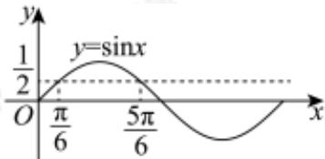

> [!faq]- 2023-2024学年3月内蒙古包头九原区包头市第九中学外国语学校高一下学期月考数学试卷解析
>
> > [!success]- **【答案】** C
>
> > [!note]- **【分析】**
> > 画出正弦函数的图象，找到 $\frac{1}{2}$ 所对应的正弦函数值，结合正弦函数的周期性求得 $x$ 的范围，即可求不等式的解集.
>
> > [!note]- **【解析】**
> > 画出正弦函数 $y = \sin x$ 的图象，如图：
> >
> > $$
> > \because \sin {\frac {\pi}{6}} = \frac {1}{2}, \sin {\frac {5 \pi}{6}} = \frac {1}{2}
> > $$
> >
> > $\therefore \sin x\geq \frac{1}{2}$ 等价 $\sin \frac{\pi}{6}\leq \sin x\leq \sin \frac{5\pi}{6}$
> >
> > 因为 $y=\sin x$ 的周期为 $2\pi$ ,
> >
> > $$
> > \therefore 2 k \pi + \frac {\pi}{6} \leq x \leq 2 k \pi + \frac {5 \pi}{6},
> > $$
> >
> > 故不等式的解集为 $\{x\mid \frac{\pi}{6} +2k\pi \leq x\leq \frac{5\pi}{6} +2k\pi ,k\in z\}$
> >
> > 故选：C.
> >
> > 
