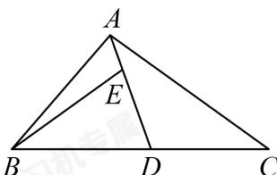

<!-- question-source:start -->
3. 如图所示， $\triangle ABC$ 中，点 $D$ 是线段 $BC$ 的中点， $E$ 是线段 $AD$ 的靠近 $A$ 的三等分点，则 $\overrightarrow{BE} = (\quad)$

A. $\frac{5}{3}\overrightarrow{BA} -\frac{1}{3}\overrightarrow{BC}$ B. $\frac{2}{3}\overrightarrow{BA} +\frac{1}{6}\overrightarrow{BC}$

C. $\frac{1}{3}\overrightarrow{BA} +\frac{1}{3}\overrightarrow{BC}$ D. $\frac{2}{3}\overrightarrow{BA} +\frac{1}{3}\overrightarrow{BC}$
<!-- question-source:end -->

![[Q00091392A1]]
