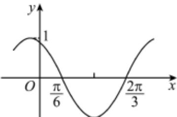

<!-- question-source:start -->
11. 如图是函数 $y = \sin (\omega x + \varphi)$ 的部分图象，则 $\sin (\omega x + \varphi) = (\quad)$

A. $\sin \left(x + \frac{\pi}{3}\right)$ B. $\sin \left(\frac{\pi}{3} - 2x\right)$ C. $\cos \left(2x + \frac{\pi}{6}\right)$ D. $\cos \left(\frac{5\pi}{6} - 2x\right)$
<!-- question-source:end -->

![[Q00091400A1]]
