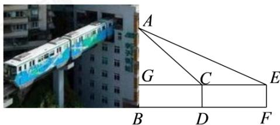

<!-- question-source:start -->
16. 李子坝站的“单轨穿楼”是重庆轨道交通的一大特色，吸引众多游客来此打卡拍照。如图所示，李明为了测量李子坝站站台距离地面的高度AB，采用了如下方法：在观景台的D点处测得站台A点处的仰角为 $60^{\circ}$ ；沿直线BD后退12米后，在F点处测得站台A点处的仰角为 $45^{\circ}$ 。已知李明的眼睛距离地面高度为CD = EF = 1.6米，则李子坝站站台的高度AB约为\_\_\_\_（精确到小数点后1位）（近似数据： $\sqrt{3} \approx 1.73$ ， $\sqrt{2} \approx 1.41$ ）。

<!-- question-source:end -->

![[Q00091405A1]]
