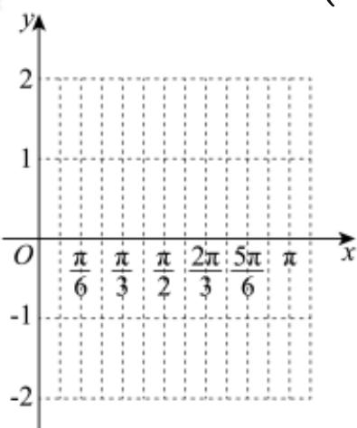

<!-- question-source:start -->
19. 已知函数 $g(x) = 2\sin \left(\omega x - \frac{\pi}{6}\right)$ 周期为 $\pi$ ，其中 $\omega > 0$ .

（1）求函数 $g(x)$ 的单调递增区间；

（2）请运用“五点法”，通过列表、描点、连线，在所给的直角坐标系中画出函数 $g(x)$ 在 $[0, \pi]$ 上的简图.
<!-- question-source:end -->

![[Q00091408A1]]
