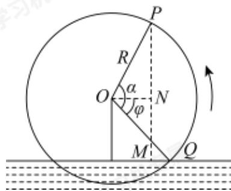

<!-- question-source:start -->
21. 水车是一种利用水流的动力进行灌溉的工具, 工作示意图如图所示。设水车 (即圆周) 的直径为 3 米, 其中心 (即圆心) $O$ 到水面的距离 $b$ 为 1.2 米, 逆时针匀速旋转一圈的时间是 80 秒。水车边缘上一点 $P$ 距水面的高度为 $h$ (单位; 米), 水车逆时针旋转时间为 $t$ (单位: 秒)。当点 $P$ 在水面上时高度记为正值; 当点 $P$ 旋转到水面以下时, 点 $P$ 距水面的高度记为负值。过点 $P$ 向水面作垂线, 交水面于点 $M$ , 过点 $O$ 作 $P M$ 的垂线, 交 $P M$ 于点 $N$ 。从水车与水面交于点 $Q$ 时开始计时 ( $t = 0$ ), 设 $\angle Q O N = \varphi$ , 水车逆时针旋转 $t$ 秒转动的角的大小记为 $\alpha$ 。

（1）求h与t的函数解析式；

(2) 当雨季来临时, 河流水量增加, 点 $O$ 到水面的距离减少了 0.3 米, 求 $\angle QON$ 的大小 (精确到 $1^{\circ}$ );

（3）若水车转速加快到原来的2倍，直接写出h与t的函数解析式．（参考数据：

$$
\sin {\frac {\pi}{5}} \approx 0. 6 0, \sin {\frac {3 \pi}{1 0}} \approx 0. 8 0, \sin {\frac {2 \pi}{5}} \approx 0. 8 6)
$$
<!-- question-source:end -->

![[Q00092682A1]]
