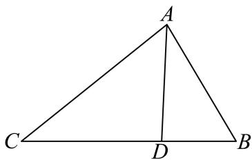

<!-- question-source:start -->
22. 如图，在 $\triangle ABC$ 中，点 $D$ 在边 $BC$ 上， $CD = 2BD$ .

(1) 若 $\cos\angle ADC = -\frac{1}{4}$ ，AC = 8，AD = 4，求 AB；

(2) 若 $\triangle ABC$ 是锐角三角形， $B = \frac{\pi}{3}$ ，求 $\frac{BD}{AB}$ 的取值范围.
<!-- question-source:end -->

![[Q00092683A1]]
