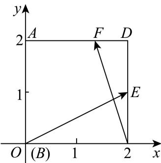

> [!faq]- 2023-2024学年4月内蒙古包头昆都仑区包钢第九中学高一下学期月考数学试卷解析
>
> > [!success]- **【答案】** $\frac{2}{3}$
>
> > [!note]- **【分析】**
> > 建系，根据平面向量的坐标运算求解.
>
> > [!note]- **【解析】**
> > 建立平面直角坐标系如图所示，则 $A(0,2)$ 、 $E(2,1)$ 、 $D(2,2)$ 、 $B(0,0)$ 、 $C(2,0)$ ，
> >
> > 
> >
> > 因为 $\overrightarrow{AF} = 2\overrightarrow{FD}$ ，则 $F\left(\frac{4}{3},2\right)$ ，可得 $\overrightarrow{BE} = (2,1)$ ， $\overrightarrow{CF} = \left(-\frac{2}{3},2\right)$ 所以 $\overrightarrow{BE}\cdot \overrightarrow{CF} = 2\times \left(-\frac{2}{3}\right) + 1\times 2 = \frac{2}{3}.$ 故答案为： $\frac{2}{3}$
