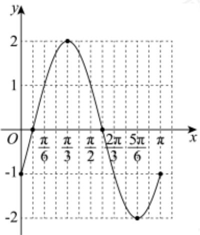

> [!faq]- 2023-2024学年4月内蒙古包头昆都仑区包钢第九中学高一下学期月考数学试卷解析
>
> > [!success]- **【答案】** 详见解析 ## (2) 答案见解析
>
> > [!note]- **【解析】**
> > （1）由题意可得 $\omega = 2$ ，所以 $g(x) = 2\sin \left(2x - \frac{\pi}{6}\right)$
> >
> > $$
> > 2 k \pi - \frac {\pi}{2} \leq 2 x - \frac {\pi}{6} \leq 2 k \pi + \frac {\pi}{2}, k \in \mathbf {Z},
> > $$
> >
> > 解得 $k\pi - \frac{\pi}{6} \leq x \leq k\pi + \frac{\pi}{3}$ ,
> >
> > 故函数 $g(x)$ 的单调递增区间为 $\left[k\pi - \frac{\pi}{6}, k\pi + \frac{\pi}{3}\right], k \in \mathbb{Z}$ .
> >
> > (2)
> >
> > <table><tr><td> $2x - \frac{\pi}{6}$ </td><td> $-\frac{\pi}{6}$ </td><td>0</td><td> $\frac{\pi}{2}$ </td><td> $\pi$ </td><td> $\frac{3\pi}{2}$ </td><td> $\frac{11\pi}{6}$ </td></tr><tr><td> $x$ </td><td>0</td><td> $\frac{\pi}{12}$ </td><td> $\frac{\pi}{3}$ </td><td> $\frac{7\pi}{12}$ </td><td> $\frac{5\pi}{6}$ </td><td> $\pi$ </td></tr><tr><td> $g(x)$ </td><td>-1</td><td>0</td><td>2</td><td>0</td><td>-2</td><td>-1</td></tr></table>
> >
> > 描点，连线，其简图如下
> >
> > 
