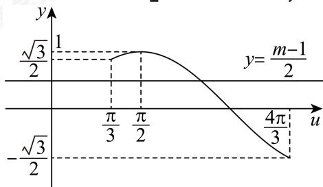

> [!faq]- 2023-2024学年4月内蒙古包头昆都仑区包钢第九中学高一下学期月考数学试卷解析
>
> > [!success]- **【答案】** 详见解析 (2)最小值为0，此时 $x=-\frac{\pi}{4}$ ；最大值为3，此时 $x=\frac{\pi}{12}$ (3) $m \in [1 - \sqrt{3}, 1 + \sqrt{3}) \cup \{3\}$
>
> > [!note]- **【分析】**
> > （1）由三角恒等变换化简后，由正弦型函数的周期公式求解；
>
> > [!note]- **【解析】**
> > （1）因为
> >
> > $f(x) = (\sin x + \cos x)^2 - 2\sqrt{3}\sin^2 x + \sqrt{3} = 1 + 2\sin x\cos x - 2\sqrt{3}\left(\frac{1 - \cos 2x}{2}\right) + \sqrt{3}$ $= \sin 2x + \sqrt{3}\cos 2x + 1 = 2\sin \left(2x + \frac{\pi}{3}\right) + 1,$ 所以函数 $f(x)$ 的最小正周期 $T = \frac{2\pi}{|2|} = \pi.$ （2）由（1）知 $f(x) = 2\sin \left(2x + \frac{\pi}{3}\right) + 1,$ 因为 $x \in \left[-\frac{\pi}{4}, \frac{\pi}{4}\right]$ ，所以 $\left(2x + \frac{\pi}{3}\right) \in \left[-\frac{\pi}{6}, \frac{5\pi}{6}\right],$ 令 $u = 2x + \frac{\pi}{3}$ ，则函数 $y = \sin u$ 在区间 $\left[-\frac{\pi}{6}, \frac{\pi}{2}\right]$ 上单调递增，在区间 $\left[\frac{\pi}{2}, \frac{5\pi}{6}\right]$ 上单调递减，
> >
> > 所以当 $u = -\frac{\pi}{6}$ 时，即 $x = -\frac{\pi}{4}$ 时， $f(x)_{\min} = f\left(-\frac{\pi}{4}\right) = 0.$
> >
> > 当 $u=\frac{\pi}{2}$ 时，即 $x=\frac{\pi}{12}$ 时， $f(x)_{\max}=f\left(\frac{\pi}{12}\right)=3.$ 综上：当 $x\in\left[-\frac{\pi}{4},\frac{\pi}{4}\right]$ ， $y=f(x)$ 的最小值为0，此时 $x=-\frac{\pi}{4}$ ；最大值为3，
> > 此时 $x=\frac{\pi}{12}$ .
> >
> > (3) 因为函数 $y = f(x) - m$ 在 $x \in \left[0, \frac{\pi}{2}\right]$ 内有且只有一个零点，
> > 所以 $f(x) - m = 0$ 在 $x \in \left[0, \frac{\pi}{2}\right]$ 只有一个实根.
> > 即 $2\sin\left(2x+\frac{\pi}{3}\right)+1-m=0\Rightarrow\sin\left(2x+\frac{\pi}{3}\right)=\frac{m-1}{2}$ 即函数 $y=\sin\left(2x+\frac{\pi}{3}\right)$ 在 $x\in\left[0,\frac{\pi}{2}\right]$ 的图象与直线 $y=\frac{m-1}{2}$ 只有一个交点，
> > 当 $x\in\left[0,\frac{\pi}{2}\right]$ 时， $2x+\frac{\pi}{3}\in\left[\frac{\pi}{3},\frac{4\pi}{3}\right]$ ,
> > 令 $u=2x+\frac{\pi}{3}$ ，则 $y=\sin u$ 在区间 $\left[\frac{\pi}{3},\frac{4\pi}{3}\right]$ 的图象与直线 $y=\frac{m-1}{2}$ 只有一
> > 个交点时，
> > 即 $\frac{m-1}{2}\in\left[-\frac{\sqrt{3}}{2},\frac{\sqrt{3}}{2}\right)\cup\{1\}$ ，解得 $m\in\left[1-\sqrt{3},1+\sqrt{3}\right)\cup\{3\}$ .
> >
> > 
