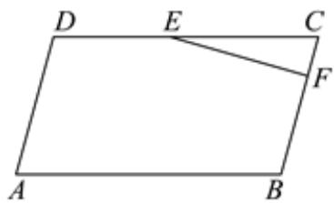

<!-- question-source:start -->
2、已知向量 $\overrightarrow{a}=(-1,1)$ ， $\overrightarrow{b}=(-3,4)$ ，则 $\cos\langle\overrightarrow{a},\overrightarrow{a}-\overrightarrow{b}\rangle=()$ A $\frac{5\sqrt{26}}{26}$ B $-\frac{5\sqrt{26}}{26}$ C $\frac{\sqrt{26}}{13}$ D $-\frac{\sqrt{26}}{13}$

<!-- question-source:end -->

![[Q00091636A1]]
