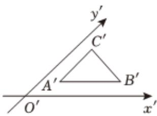

<!-- question-source:start -->
6、如图， $\triangle A'B'C'$ 是水平放置 $\triangle ABC$ 的直观图，其中 $B'C' = C'A' = 1$ ， $A'B' // x'$ 轴， $A'C' // y'$ 轴，则 $BC = (\quad)$ A $\sqrt{2}$ B 2

C $\sqrt{6}$ D 4

<!-- question-source:end -->

![[Q00091640A1]]
