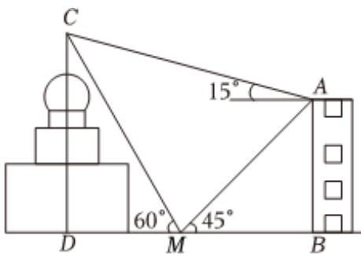

<!-- question-source:start -->
7、圣·索菲亚教堂是哈尔滨的标志性建筑，其中央主体建筑集球、圆柱、棱柱于一体，极具对称之美。为了估算圣·索菲亚教堂的高度，某人在教堂的正东方向找到一座建筑物AB，高约为36m，在它们之间的地面上的点 $M(B, M, D$ 三点共线）处测得建筑物顶A、教堂顶C的仰角分别是 $45^{\circ}$ 和 $60^{\circ}$ ，在建筑物顶A处测得教堂顶C的仰角为 $15^{\circ}$ ，则可估算圣·索菲亚教堂的高度CD约为（）
A 54m
B 47m
C 50m
D 44m

<!-- question-source:end -->

![[Q00091641A1]]
