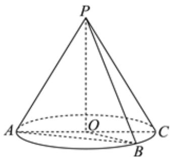

<!-- question-source:start -->
5、

已知圆锥的顶点为 $P$ ，母线 $PA$ ， $PB$ 所成角的余弦值为 $\frac{1}{4}$ ，轴截面等腰三角形 $PAC$ 的顶角为 $90^{\circ}$ ，若 $\triangle PAB$ 的面积为 $2\sqrt{15}$

1 求该圆锥的侧面积；

2 求该圆锥的内接圆柱侧面积的最大值.
<!-- question-source:end -->

![[Q00091655A1]]
