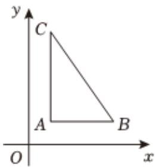

> [!faq]- 2023-2024学年内蒙古乌海一中高一（下）期中数学试卷解析
>
> > [!success]- **【答案】** C
>
> > [!note]- **【解析】**
> > 在 $\triangle A'B'C'$ 中， $B^{\prime}C^{\prime} = C^{\prime}A^{\prime} = 1$ ， $\angle B'A'C' = 45^{\circ}$
> >
> > 由余弦定理得： $B^{\prime}C^{\prime 2} = A^{\prime}C^{\prime 2} + A^{\prime}B^{\prime 2} - 2A^{\prime}C^{\prime}\cdot A^{\prime}B^{\prime}\cos 45^{\circ},$
> >
> > 即 $A^{\prime}B^{\prime 2} - \sqrt{2} A^{\prime}B^{\prime} = 0$ ，而 $A^{\prime}B^{\prime} > 0$
> >
> > 解得 $A^{\prime}B^{\prime}=\sqrt{2}$ ，
> >
> > 由斜二测画图法知： $AB = A'B' = \sqrt{2}$ ， $AC = 2A'C' = 2$
> >
> > 在 $\triangle ABC$ 中， $AB\perp AC$ ，
> >
> > 所以 $BC = \sqrt{AC^2 + AB^2} = \sqrt{6}.$
> >
> > 
> >
> > 故选：C.
