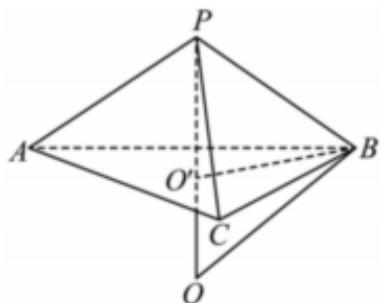
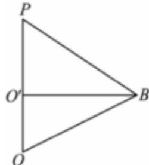

> [!faq]- 2023-2024学年内蒙古乌海一中高一（下）期中数学试卷解析
>
> > [!success]- **【答案】** $16\pi$
>
> > [!note]- **【解析】**
> > 如图设底面 $\triangle ABC$ 的中心为 $O'$ ，连接 $PO'$ ，则球心在直线 $PO'$ 上，
> >
> > 由几何关系可知， $BO' = \frac{\sqrt{3}}{3} \times 3 = \sqrt{3}$ ，先将三角形 $PO'B$ 转化成平面三角形，如图：
> >
> > 
> >
> > 因为 $|PB|=2$ ，由勾股定理可得 $PO'=\sqrt{2^{2}-(\sqrt{3})^{2}}=\sqrt{4-3}=1$ ，
> >
> > 设球心为O，则O在 $PO'$ 的延长线上，且 $|OP|=|OB|=R$ ，则 $|OO'|=R-1$ ，
> >
> > 
> >
> > 由勾股定理可得 $\left|O^{\prime}B\right|^{2}+\left|OO^{\prime}\right|^{2}=\left|OB\right|^{2}$
> >
> > 即 $(\sqrt{3})^2 +(R - 1)^2 = R^2$
> >
> > 解得R=2，
> >
> > 所以球体的表面积 $S=4\pi R^{2}=16\pi.$
> >
> > 故答案为： $16\pi$
