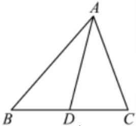

> [!faq]- 2023-2024学年内蒙古乌海一中高一（下）期中数学试卷解析
>
> > [!success]- **【答案】** 详见解析
>
> > [!note]- **【解析】**
> > 详见解析
> >
> > (1)若 $b\sin 2A = a\sin B$ ，由正弦定理得， $2\sin B\sin A\cos A = \sin A\sin B$ ，
> >
> > $$
> > \because \sin B \neq 0, \sin A \neq 0, \therefore \cos A = \frac {1}{2}
> > $$
> >
> > $$
> > \because 0 <   A <   \pi , \therefore A = \frac {\pi}{3}.
> > $$
> >
> > (2)若选①，由 $\overrightarrow{AB} \cdot \overrightarrow{AC} = 2$ ，得 $bc\cos A = 2$ ，则 $bc = 4$
> >
> > 又余弦定理得 $a^2 = b^2 + c^2 - 2bc\cos A$ ，即 $b^2 + c^2 = 8$
> >
> > $\therefore$ 联立解得 $\pmb{b} = \pmb{c} = 2$
> >
> > 若选②，由 $\triangle ABC$ 的面积为 $\sqrt{3}$ ，得 $\frac{1}{2} bc\sin A = \sqrt{3}$ ，即 $bc = 4$
> >
> > 又余弦定理得 $a^2 = b^2 + c^2 - 2bc\cos A$ ，即 $b^2 + c^2 = 8$
> >
> > $\therefore$ 联立解得 $b = c = 2$ .
> >
> > 若选③，设边BC上的中点为D，
> >
> > 
> >
> > 则 $\overrightarrow{AD} = \frac{1}{2} (\overrightarrow{AB} +\overrightarrow{AC})$
> >
> > $$
> > \overrightarrow {A D ^ {2}} = \frac {1}{4} (\overrightarrow {A B} + \overrightarrow {A C}) ^ {2} = \frac {1}{4} (A B ^ {2} + \overrightarrow {A C ^ {2}} + 2 \overrightarrow {A B} \cdot \overrightarrow {A C}) = (\sqrt {3}) ^ {2},
> > $$
> >
> > $\frac{1}{4} (b^2 +c^2 +2bccosA) = 3$ ，即 $b^{2} + c^{2} + bc = 12$
> >
> > 又余弦定理得 $a^2 = b^2 + c^2 - 2bc\cos A$ ，即 $b^2 + c^2 - bc = 4$
> >
> > $\therefore$ 联立解得 $\pmb{b} = \pmb{c} = 2$
