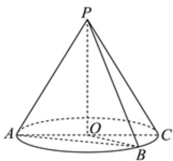
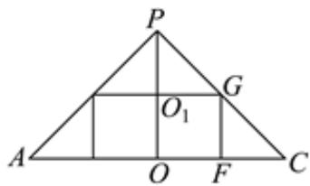

> [!faq]- 2023-2024学年内蒙古乌海一中高一（下）期中数学试卷解析
>
> > [!success]- **【答案】** 详见解析
>
> > [!note]- **【解析】**
> > 详见解析
> >
> > (1) 设圆锥母线长、底面半径分别为 $l(l > 0)$ 、 $r(r > 0)$ ，
> >
> > 由圆锥的轴截面为等腰三角形且顶角为 $90^{\circ}$
> >
> > 则 $l^2 + l^2 = (2r)^2$
> >
> > 解得 $l = \sqrt{2} r$
> >
> > 又 $\cos\angle APB=\frac{1}{4}$ ，
> >
> > 所以 $sin\angle APB = \sqrt{1 - cos^2\angle APB} = \sqrt{1 - \left(\frac{1}{4}\right)^2} = \frac{\sqrt{15}}{4}$
> >
> > 
> >
> > 又因为 $\triangle PAB$ 的面积为 $2\sqrt{15}$
> >
> > 所以 $S_{\triangle PAB} = \frac{1}{2} PA\bullet PB\bullet sin\angle APB = \frac{1}{2} l^2\times \frac{\sqrt{15}}{4} = 2\sqrt{15},$
> >
> > 解得l=4(负值舍去)，
> >
> > 又 $l=\sqrt{2}r$ ，所以 $r=2\sqrt{2}$ ，
> >
> > 所以圆锥的侧面积 $S = \frac{1}{2} \times 2\pi r \times l = \pi \times 2\sqrt{2} \times 4 = 8\sqrt{2}\pi$ ；
> >
> > (2)作出轴截面如图所示：由（1）可知 $\angle CPO = 45^{\circ}$
> >
> > 设圆柱底面半径 $x(0 < x < 2\sqrt{2})$ ，即 $OF = O_{1}G = PO_{1} = x$
> >
> > 则圆锥的高 $PO = AO = 2\sqrt{2}$
> >
> > 所以 $OO_{1}=PO-PO_{1}=2\sqrt{2}-x$ ，即圆柱的高为 $2\sqrt{2}-x$
> >
> > 
> >
> > 所以圆锥内接圆柱的侧面积
> >
> > $$
> > S _ {1} = 2 \pi x (2 \sqrt {2} - x) \leq 2 \pi \left[ \frac {x + (2 \sqrt {2} - x)}{2} \right] ^ {2} = 4 \pi ,
> > $$
> >
> > 当且仅当 $x = 2\sqrt{2} - x$ ，即 $x = \sqrt{2}$ 时取等号，
> >
> > 所以圆锥内接圆柱的侧面积的最大值为 $4\pi$ .
