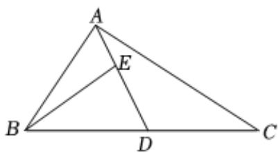

<!-- question-source:start -->
2、已知角 $\alpha$ 的终边经过点 $P(-8, m)$ ，且 $tan\alpha = -\frac{3}{4}$ ，则 $\sin\alpha$ 的值是（）  
A $\frac{3}{5}$ B $-\frac{3}{5}$ C $-\frac{4}{5}$ D $\frac{4}{5}$

<!-- question-source:end -->

![[Q00091658A1]]
