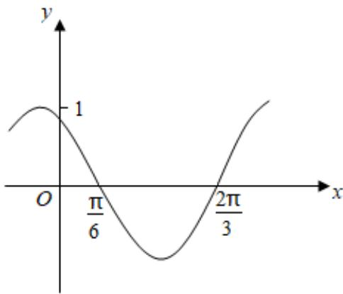

<!-- question-source:start -->
3、如图是函数 $y=\sin(\omega x+\varphi)$ 的部分图象，则 $\sin(\omega x+\varphi)=(\quad)$

A $\sin (x + \frac{\pi}{3})$ B $\sin (\frac{\pi}{3} - 2x)$ C $\cos (2x + \frac{\pi}{6})$ D $\cos (\frac{5\pi}{6} - 2x)$
<!-- question-source:end -->

![[Q00091667A1]]
