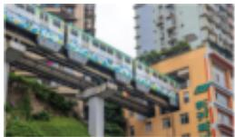
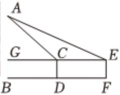

<!-- question-source:start -->
4、李子坝站的“单轨穿楼”是重庆轨道交通的一大特色，吸引众多游客来此打卡拍照。如图所示，李明为了测量李子坝站站台距离地面的高度 $AB$ ，采用了如下方法：在观景台的 $D$ 点处测得站台 $A$ 点处的仰角为 $60^{\circ}$ ；沿直线 $BD$ 后退12米后，在 $F$ 点处测得站台 $A$ 点处的仰角为 $45^{\circ}$ 。已知李明的眼睛距离地面高度为

$CD = EF = 1.6$ 米，则李子坝站站台的高度 $AB$ 约为 \_\_\_\_ (精确到小数点后1位)（近似数据：

$\sqrt{3} \approx 1.73, \sqrt{2} \approx 1.41)$ .

<!-- question-source:end -->

![[Q00091672A1]]
