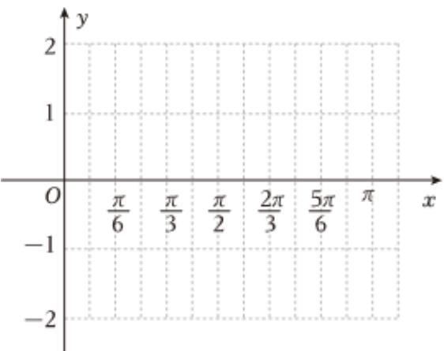

<!-- question-source:start -->
3、

已知函数 $g(x)=2\sin(\omega x-\frac{\pi}{6})$ 周期为 $\pi$ ，其中 $\omega>0$ .

1 求函数 $g(x)$ 的单调递增区间；

2 请运用“五点法”，通过列表、描点、连线，在所给的直角坐标系中画出函数 $g(x)$ 在 $[0, \pi]$ 上的简图.
<!-- question-source:end -->

![[Q00092197A1]]
