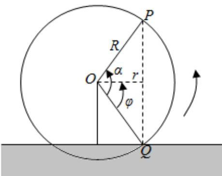

<!-- question-source:start -->
5、

水车是一种利用水流的动力进行灌溉的工具，工作示意图如图所示。设水车（即圆周）的直径为3米，其中心（即圆心）O到水面的距离b为1.2米，逆时针匀速旋转一圈的时间是80秒。水车边缘上一点P距水面的高度为h（单位；米），水车逆时针旋转时间为t（单位：秒）。当点P在水面上时高度记为正值；当点P旋转到水面以下时，点P距水面的高度记为负值。过点P向水面作垂线，交水面于点M，过点O作PM的垂线，交PM于点N。从水车与水面交于点Q时开始计时(t=0)，设 $\angle QON=\varphi$ ，水车逆时针旋转t秒转动的角的大小记为 $\alpha$ 。

1 求 $h$ 与 $t$ 的函数解析式；

2 当雨季来临时，河流水量增加，点O到水面的距离减少了0.3米，求 $\angle QON$ 的大小（精确到1°）；

若水车转速加快到原来的2倍，直接写出h与t的函数解析式.

3 (参考数据： $sin\frac{\pi}{5} \approx 0.60$ ， $sin\frac{3\pi}{10} \approx 0.80$ ， $sin\frac{2\pi}{5} \approx 0.86$ )
<!-- question-source:end -->

![[Q00092199A1]]
