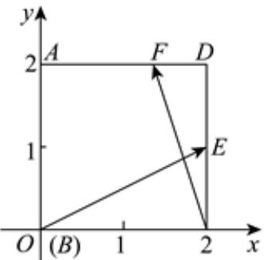

> [!faq]- 2023-2024学年内蒙古包头九中高一（下）月考数学试卷（4月份）解析
>
> > [!success]- **【答案】** $\frac{2}{3}$
>
> > [!note]- **【解析】**
> > 建立平面直角坐标系如图所示，则 $A(0,2)$ ， $E(2,1)$ ， $D(2,2)$ ， $B(0,0)$ ， $C(2,0)$ ，
> >
> > 
> >
> > 因为 $\overrightarrow{AF} = 2\overrightarrow{FD}$ ，则 $F\left(\frac{4}{3},2\right)$ ，可得 $\overrightarrow{BE} = (2,1),\overrightarrow{CF} = (-\frac{2}{3},2)$
> >
> > 所以 $\overrightarrow{BE} \cdot \overrightarrow{CF} = 2 \times (-\frac{2}{3}) + 1 \times 2 = \frac{2}{3}$ .
> >
> > 故答案为： $\frac{2}{3}$ .
