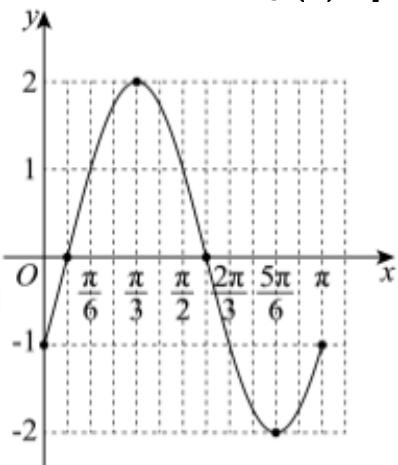

> [!faq]- 2023-2024学年内蒙古包头九中高一（下）月考数学试卷（4月份）解析
>
> > [!success]- **【答案】** 详见解析
>
> > [!note]- **【解析】**
> > 详见解析
> >
> > (1) $\because$ 函数 $g(x) = 2\sin (\omega x - \frac{\pi}{6})$ 周期为 $\pi$ ，其中 $\omega > 0$
> >
> > $\therefore \frac{2\pi}{\omega} = \pi$ ，解得 $\omega = 2$
> >
> > $\therefore g(x) = 2\sin \left(2x - \frac{\pi}{6}\right)$ ,
> >
> > $$
> > 2 k \pi - \frac {\pi}{2} \leq 2 x - \frac {\pi}{6} \leq 2 k \pi + \frac {\pi}{2}, k \in Z
> > $$
> >
> > 解得 $k\pi - \frac{\pi}{6} \leqslant x \leqslant k\pi + \frac{\pi}{3}$ ， $k \in Z$ ，
> >
> > $\therefore$ 函数 $g(x)$ 的单调递增区间为 $[k\pi - \frac{\pi}{6}, k\pi + \frac{\pi}{3}]$ , $k \in Z$ .
> >
> > (2)列表：
> >
> > <table><tr><td> $2x - \frac{\pi}{6}$ </td><td> $-\frac{\pi}{6}$ </td><td>0</td><td> $\frac{\pi}{2}$ </td><td> $\pi$ </td><td> $\frac{3\pi}{2}$ </td><td> $\frac{11\pi}{6}$ </td></tr><tr><td> $x$ </td><td>0</td><td> $\frac{\pi}{12}$ </td><td> $\frac{\pi}{3}$ </td><td> $\frac{7\pi}{12}$ </td><td> $\frac{5\pi}{6}$ </td><td> $\pi$ </td></tr><tr><td> $g(x)$ </td><td>-1</td><td>0</td><td>2</td><td>0</td><td>-2</td><td>-1</td></tr></table>
> >
> > 描点，连线，作出函数 $g(x)$ 在 $[0, \pi]$ 上的简图：
> >
> > 
