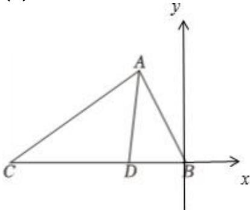

> [!faq]- 2023-2024学年内蒙古包头九中高一（下）月考数学试卷（4月份）解析
>
> > [!success]- **【答案】** 详见解析
>
> > [!note]- **【解析】**
> > 详见解析
> >
> > (1) 根据余弦定理，在 $\triangle ACD$ 中，
> >
> > $$
> > \cos \angle A D C = \frac {A D ^ {2} + C D ^ {2} - A C ^ {2}}{2 \times C D \times A D} = \frac {C D ^ {2} - 4 8}{8 C D} = - \frac {1}{4},
> > $$
> >
> > 则 $CD = 6$ ，所以 $BC = \frac{2}{3} CD = 9$
> >
> > $$
> > \cos \angle C = \frac {C D ^ {2} + A C ^ {2} - A D ^ {2}}{2 \times C D \times A C} = \frac {3 6 + 6 4 - 1 6}{2 \times 6 \times 8} = \frac {7}{8}
> > $$
> >
> > 在 $\triangle ABC$ 中
> >
> > $$
> > A B ^ {2} = A C ^ {2} + B C ^ {2} - 2 A C \times B C \times \cos C
> > $$
> >
> > $$
> > = 6 4 + 8 1 - 2 \times 8 \times 9 \times \frac {7}{8} = 1 9
> > $$
> >
> > 所以 $AB = \sqrt{19}$
> >
> > (2)以B为坐标原点，BC所在直线为x轴，建立如图所示直角坐标系，
> >
> > 
> >
> > 设 $BC = 3$ ， $AB = t$ ，又 $CD = 2BD$ ，则 $BD = 1$
> >
> > 则 $A\left(-\frac{t}{2}, \frac{\sqrt{3}}{2} t\right), B(0,0), C(-3,0)$
> >
> > $$
> > \overrightarrow {C A} = \left(- \frac {t}{2} + 3, \frac {\sqrt {3}}{2} t\right), \overrightarrow {C B} = (3, 0), \overrightarrow {A C} = \left(\frac {t}{2} - 3, - \frac {\sqrt {3}}{2} t\right), \overrightarrow {A B} = \left(\frac {t}{2}, - \frac {\sqrt {3}}{2} t\right)
> > $$
> >
> > 由 $\triangle ABC$ 是锐角三角形，可得 $\left\{ \begin{array}{l} \overrightarrow{CA} \bullet \overrightarrow{CB} > 0 \\ \overrightarrow{AC} \bullet \overrightarrow{AB} > 0 \end{array} \right.$
> >
> > 即 $\left\{ \begin{array}{l} 3(-\frac{t}{2} + 3) > 0 \\ \frac{t}{2} (\frac{t}{2} - 3) + \frac{3t^2}{4} > 0 \end{array} \right.$ ，解得 $\frac{3}{2} < t < 6$
> >
> > 故 $\frac{BD}{AB} = \frac{1}{t}\in (\frac{1}{6},\frac{2}{3}).$
