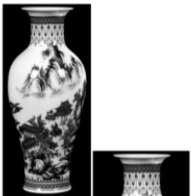

<!-- question-source:start -->
8、景德镇陶瓷世界闻名，其中青花瓷最受大家的喜爱，如图1这个精美的青花瓷花瓶，它的颈部（图2）外形上下对称，基本可看作是离心率为 $\frac{\sqrt{34}}{3}$ 的双曲线的一部分绕其虚轴所在直线旋转所形的曲面，若该颈部中最细处直径为16厘米，颈部高为20厘米，则瓶口直径为（）

  
图1  
图2

A 20

B 30
C 40
D 50
<!-- question-source:end -->

![[Q00091686A1]]
