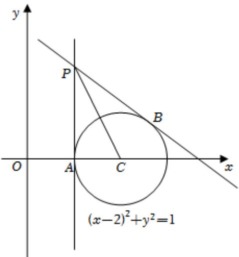

<!-- question-source:start -->
3、

已知圆 $C:(x-2)^{2}+y^{2}=1$ ，动直线l过点 $P(1,2)$ .

1 当直线 $l$ 与圆 $C$ 相切时，求直线 $l$ 的方程；

2 若直线 l 与圆 C 相交于 A、B 两点，求 AB 中点 M 的轨迹方程

<!-- question-source:end -->

![[Q00091697A1]]
