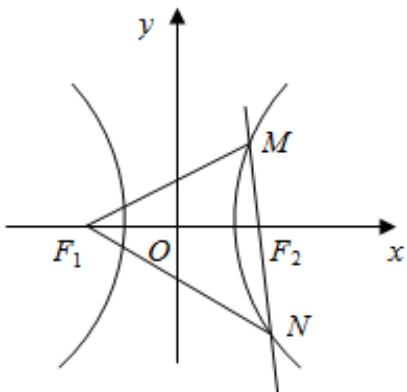

> [!faq]- 2023-2024学年内蒙古包头市铁路一中高二（上）第一次月考数学试卷解析
>
> > [!success]- **【答案】** C
>
> > [!note]- **【解析】**
> > $\because$ 双曲线为 $\frac{x^2}{9} -\frac{y^2}{16} = 1,\therefore a = 3,$
> >
> > 由双曲线的定义得 $\left|MF_{1}\right|-\left|MF_{2}\right|=\left|NF_{1}\right|-\left|NF_{2}\right|=2a=6$ $\therefore \left|MF_{1}\right| + \left|NF_{1}\right| = \left|MF_{2}\right| + \left|NF_{2}\right| + 4a = \left|M N\right| + 12 = 24$ $\therefore \triangle MNF_{1}周长为\left|MF_{1}\right|+\left|NF_{1}\right|+\left|MN\right|=24+12=36$ 故选：C.
> >
> > 
