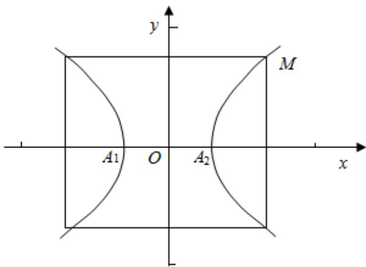

> [!faq]- 2023-2024学年内蒙古包头市铁路一中高二（上）第一次月考数学试卷解析
>
> > [!success]- **【答案】** A
>
> > [!note]- **【解析】**
> > 由题意作出轴截面如图：M点是双曲线与截面的一个交点，
> >
> > 设双曲线的方程为： $\frac{x^2}{a^2} -\frac{y^2}{b^2} = 1$ ， $(a > 0,b > 0)$
> >
> > 花瓶的最小直径 $A_{1}A_{2}=2a=16cm$ ，则a=8，
> >
> > 离心率为 $\frac{\sqrt{34}}{3}$ ，可得 $c = \frac{8\sqrt{34}}{3}$ ，所以 $b = \sqrt{c^2 - a^2} = \frac{40}{3}$ ，
> >
> > $\frac{x^2}{64} - \frac{9y^2}{1600} = 1$ ，由颈部高为20厘米， $y = 10$ ，代入双曲线方程化简可得 $\frac{x^2}{64} - \frac{9}{16} = 1$ ，解得 $x = 10$
> >
> > ∴则瓶口直径为20.
> >
> > 故选：A.
> >
> > 
