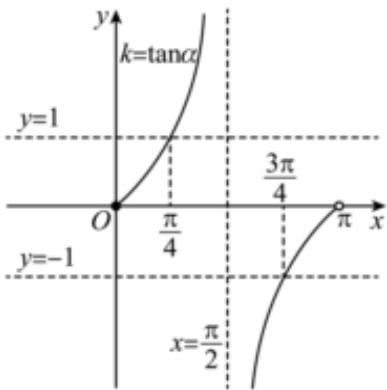

> [!faq]- 2023-2024学年内蒙古包头市铁路一中高二（上）第一次月考数学试卷解析
>
> > [!success]- **【答案】** AD
>
> > [!note]- **【解析】**
> > 对于选项A：设与直线 $3x+2y+7=0$ 平行的直线方程是 $3x+2y+c=0\left(c\neq7\right)$ ，
> >
> > 因为直线 $3x + 2y + c = 0 (c \neq 7)$ 过点 $(-1, 2)$
> >
> > 则 $-3 + 4 + c = 0$ ，解得 $c = -1$
> >
> > 所以过点 $(-1,2)$ 且和直线 $3x + 2y + 7 = 0$ 平行的直线方程是 $3x + 2y - 1 = 0$ ，故 $A$ 正确；
> >
> > 对于选项 $B$ ：因为 $\pmb {k} = \pmb{tan}\alpha$ ， $\alpha \in [0,\frac{\pi}{2})\cup (\frac{\pi}{2},\pi)$ ，如图所示，
> >
> > 
> >
> > 若 $k \in [-1, 1]$ ，所以 $\alpha \in [0, \frac{\pi}{4}] \cup [\frac{3\pi}{4}, \pi)$ ，故 $B$ 错误；
> >
> > 对于选项 $C$ ：若直线 $l_{1}:x - 2y + 3 = 0$ 与 $l_{2}:2x + ay - 2 = 0$ 平行，
> >
> > 则 $1 \times a = -2 \times 2$ ，解得a = -4，
> >
> > 可知 $l_{2}:2x-4y-2=0$ ，即x-2y-1=0，所以 $l_{1}$ 与 $l_{2}$ 的距离为 $d = \frac{|3 - (-1)|}{\sqrt{1^2 + (-2)^2}} = \frac{4\sqrt{5}}{5}$ ，故 $C$ 错误；  
> > 对于选项 $D$ ：圆 $C_1: x^2 + y^2 - 4x - 2y + 4 = 0$ 的圆心 $C_1(2,1)$ ，半径 $r_1 = 1$ ，圆 $C_2: x^2 + y^2 - 6y + 5 = 0$ 的圆心 $C_2(0,3)$ ，半径 $r_2 = 2$ ，因为 $|C_1C_2| = \sqrt{(2 - 0)^2 + (1 - 3)^2} = 2\sqrt{2}$ ，且 $1 < 2\sqrt{2} < 3$ ，即 $|r_1 - r_2| < |C_1C_2| < r_1 + r_2$ ，所以圆 $C_1$ 和圆 $C_2$ 相交，故 $D$ 正确.故选： $AD$ .
