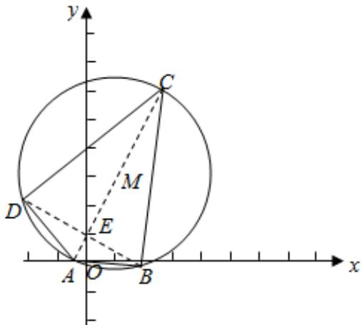

> [!faq]- 2023-2024学年内蒙古包头市铁路一中高二（上）第一次月考数学试卷解析
>
> > [!success]- **【答案】** $10\sqrt{2}$
>
> > [!note]- **【解析】**
> > 圆 $x^{2}+y^{2}-2x-6y=0$ 即 $(x-1)^{2}+(y-3)^{2}=10$ 表示以M(1,3)为圆心，以 $\sqrt{10}$ 为半径的圆.
> > 由圆的弦的性质可得，最长的弦即圆的直径，AC的长为 $2\sqrt{10}$ .
> > ∵点 $E(0,1)$ ，∴ $ME=\sqrt{1+4}=\sqrt{5}$ .
> > 弦长BD最短时，弦BD和ME垂直，且经过点E，此时， $BD=2\sqrt{MB^{2}-ME^{2}}=2\sqrt{10-5}=2\sqrt{5}$
> >
> > 故四边形ABCD的面积为 $\frac{1}{2}AC\times BD=10\sqrt{2}$ ，故答案为 $10\sqrt{2}$ .
> >
> > 
