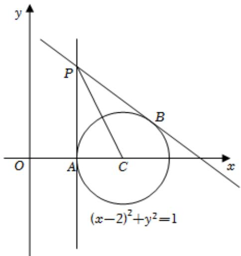

> [!faq]- 2023-2024学年内蒙古包头市铁路一中高二（上）第一次月考数学试卷解析
>
> > [!success]- **【答案】** 详见解析
>
> > [!note]- **【解析】**
> > 详见解析
> >
> > （1）当直线l斜率不存在时x=1，显然直线l与圆C相切且切点为 $A(1,0)$ ；
> > 所以，对于另一条切线，若切点为B，则 $\angle APB=2\angle APC$ ，又 $tan\angle APC=\frac{1}{2}$ 所以 $\tan\angle APB=\frac{2\tan\angle APC}{1-\tan^{2}\angle APC}=\frac{4}{3}$ ，由图知：直线BP的倾斜角的补角与 $\angle APB$ 互余，
> > 所以直线BP的斜率为 $-\frac{3}{4}$ ，故另一条切线方程为 $y-2=-\frac{3}{4}(x-1)$ ，即 $3x+4y-11=0$ ，此时切点 $B(\frac{13}{5},\frac{4}{5})$
> >
> > 
> >
> > 综上，直线l的方程为x=1或3x+4y-11=0.
> >
> > (2)由（1）知：直线 $l$ 与圆 $C$ 相交于 $\pmb{A}$ 、 $\pmb{B}$ 两点，则斜率必存在，
> >
> > 设 $M(x,y)$ ，则 $\left|CM\right|^2 +\left|PM\right|^2 = \left|PC\right|^2 = 5$
> >
> > 所以 $(x - 2)^{2} + y^{2} + (x - 1)^{2} + (y - 2)^{2} = 5$ ，整理得 $(x - \frac{3}{2})^2 +(y - 1)^2 = \frac{5}{4}$
> >
> > 由（1）得： $1 < x < \frac{13}{5}$ ，且 $1 - \frac{\sqrt{5}}{2} \leq y < \frac{4}{5}$ .
> >
> > 综上，故 $M$ 的轨迹方程为 $(x - \frac{3}{2})^2 + (y - 1)^2 = \frac{5}{4}$ 且 $1 < x < \frac{13}{5}$ ， $1 - \frac{\sqrt{5}}{2} \leq y < \frac{4}{5}$ .
