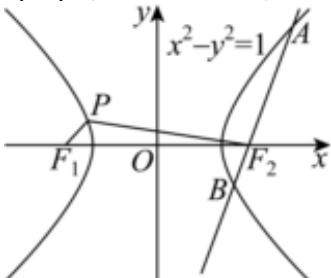

> [!faq]- 2023-2024学年内蒙古包头市铁路一中高二（上）第一次月考数学试卷解析
>
> > [!success]- **【答案】** 详见解析
>
> > [!note]- **【解析】**
> > 详见解析
> >
> > (1) 不妨设点 $P$ 在第二象限，如图所示：
> >
> > 
> >
> > 根据题意得 $\left|\left|PF_{1}\right|-\left|PF_{2}\right|\right|=2a=2$ ，
> >
> > 所以 $\left|\left|PF_{1}\right|-\left|PF_{2}\right|\right|^{2}=4$
> >
> > 即 $\left|PF_{1}\right|^{2}+\left|PF_{2}\right|^{2}-2\left|PF_{1}\right|\left|PF_{2}\right|=4①$
> >
> > 又因为 $c = \sqrt{a^2 + b^2} = \sqrt{1 + 1} = \sqrt{2}$
> >
> > 所以 $\left|F_{2}F_{1}\right|^{2}=(2c)^{2}=(2\sqrt{2})^{2}=8$
> >
> > 在 $\triangle PF_{1}F_{2}$ 中，由余弦定理有： $|F_1F_2|^2 = 8 = |PF_1|^2 + |PF_2|^2 - 2|PF_1||PF_2|cos120^\circ$
> >
> > 即 $\left|PF_{1}\right|^{2}+\left|PF_{2}\right|^{2}+\left|PF_{1}\right|\left|PF_{2}\right|=8②$
> >
> > 联立①②解得： $\left|PF_{1}\right|\left|PF_{2}\right|=\frac{4}{3}$ ， $\left|PF_{1}\right|^{2}+\left|PF_{2}\right|^{2}=\frac{20}{3}$ ，
> >
> > $$
> > S _ {\triangle F _ {1} P F _ {2}} = \frac {1}{2} | P F _ {1} | | P F _ {2} | \sin 1 2 0 ^ {\circ} = \frac {1}{2} \times \frac {4}{3} \times \frac {\sqrt {3}}{2} = \frac {\sqrt {3}}{3}
> > $$
> >
> > $$
> > \left(\left| P F _ {1} \right| + \left| P F _ {2} \right|\right) ^ {2} = \left| P F _ {1} \right| ^ {2} + \left| P F _ {2} \right| ^ {2} + 2 \left| P F _ {1} \right| \left| P F _ {2} \right| = \frac {2 8}{3}
> > $$
> >
> > 所以 $\left|PF_{1}\right|+\left|PF_{2}\right|=\frac{2\sqrt{21}}{3}$ ;
> >
> > (2)由题，右焦点 $F_{2}(\sqrt{2},0)$ ，且直线AB的斜率 $k=tan60^{\circ}=\sqrt{3}$
> >
> > 所以直线 $AB$ 的方程为： $y = \sqrt{3} (x - \sqrt{2})$ ，设 $A(x_1, y_1), B(x_2, y_2)$ ，
> >
> > 联立方程组 $\left\{ \begin{array}{l} y = \sqrt{3} (x - \sqrt{2}) \\ x^2 - y^2 = 1 \end{array} \right.$ ，化简得： $2x^2 - 6\sqrt{2} x + 7 = 0$ ，则 $\Delta = 16 > 0$ ，
> >
> > 所以 $x_{1}+x_{2}=3\sqrt{2},x_{1}x_{2}=\frac{7}{2}$
> >
> > 所以 $|AB|=\sqrt{1+k^{2}}\bullet|x_{1}-x_{2}|=\sqrt{1+k^{2}}\bullet\sqrt{(x_{1}+x_{2})^{2}-4x_{1}x_{2}}$
> >
> > $$
> > = \sqrt {1 + (\sqrt {3}) ^ {2}} \times \sqrt {(3 \sqrt {2}) ^ {2} - 4 \times \frac {7}{2}} = 4.
> > $$
