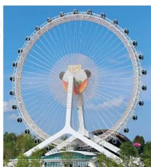
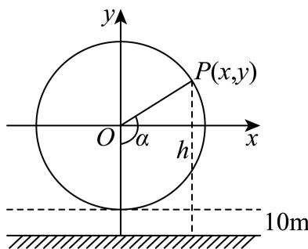

<!-- question-source:start -->
7. 已知摩天轮的半径为60m，其中心距离地面70m，摩天轮做匀速转动，每30min转一圈，摩天轮上点P的起始位置在最低点处．则在时刻t（min）时，点P离地面的高度h为（）

A.

$$
6 0 \sin {\frac {1}{1 5}} \pi t + 7 0
$$

B.

C.

$$
\sin (\frac {1}{1 5} \pi t - \frac {1}{2} \pi) + 7 0
$$

$$
6 0 \sin (\frac {1}{1 5} \pi t + \frac {1}{2} \pi) + 7 0
$$

D.

$$
6 0 \cos (\frac {1}{1 5} \pi t - \frac {1}{2} \pi) + 7 0
$$
<!-- question-source:end -->

![[Q00091374A1]]
