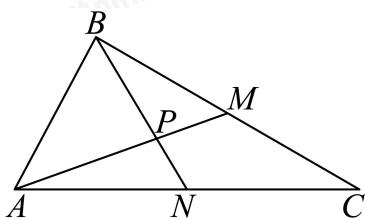

<!-- question-source:start -->
8. 如图, 在 $\triangle ABC$ 中, 已知 $AB = 2$ , $AC = 4$ , $\angle BAC = 60^{\circ}$ , $BC$ , $AC$ 边上的两条中线 $AM$ , $BN$ 相交于点 $P$ , 则 $\cos \langle \overrightarrow{PM}, \overrightarrow{PN} \rangle = (\quad)$

A. $\frac{4\sqrt{91}}{91}$ B. $\frac{\sqrt{3}}{6}$ C. $\frac{\sqrt{7}}{14}$ D. $\frac{\sqrt{3}}{3}$
<!-- question-source:end -->

![[Q00091375A1]]
