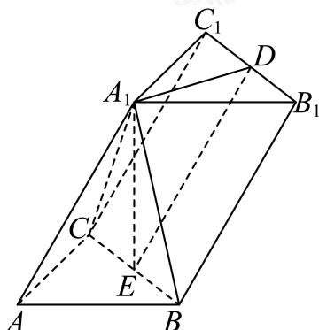

<!-- question-source:start -->
22. 如图，在三棱柱 $ABC-A_{1}B_{1}C_{1}$ 中， $\angle BAC=90^{\circ}$ ，AB=AC=2， $AA_{1}=4$ ，D，E分别是 $B_{1}C_{1}$ ，BC的中点，连接 $A_{1}D$ ， $A_{1}E$ ，且 $A_{1}E\perp$ 平面ABC.

(1)求证： $A_{1}D\bot$ 平面 $A_{1}BC;$

(2)求直线 $A_{1}C$ 与平面 $BCC_{1}B_{1}$ 所成角的正弦值.
<!-- question-source:end -->

![[Q00091389A1]]
