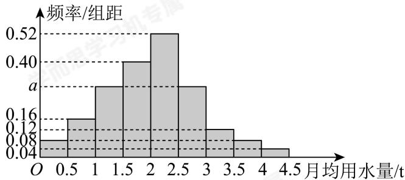

<!-- question-source:start -->
21. 我国是世界上严重缺水的国家，城市缺水问题较为突出。某市政府为了鼓励居民节约用水，计划在本市试行居民生活用水定额管理，即确定一个合理的居民用水量标准 $x$ （单位： $t$ ），月用水量不超过 $x$ 的部分按平价收费，超出 $x$ 的部分按议价收费。为了了解全市居民用水量分布情况，通过抽样，获得了100位居民某年的月均用水量（单位： $t$ ），将数据按照[0, 0.5)，[0.5, 1)，…，[4, 4.5]分成9组，制成了如图所示的频率分布直方图。

（1）求频率分布直方图中a的值；

(2) 若该市政府希望使 $90 \%$ 的居民每月的用水量不超过标准 $\mathbf{x} t$ , 估计 $\mathbf{x}$ 的值, 并说明理由.

(3) 在100位居民中, 第2组有 $n$ 位居民, 若这 $n$ 位居民月均用水量的平均数为 $0.75t$ , 方差为 $s^2$ , 若其中一位居民的用水量为 $0.75t$ , 请判断其它 $(n - 1)$ 位居民月均用水量的方差 $s_1^2$ 与 $s^2$ 的大小关系, 并说明理由. (参考公式: $s^2 = \frac{1}{n} \sum_{i=1}^{n} (x_i - \overline{x})^2$ )
<!-- question-source:end -->

![[Q00092688A1]]
