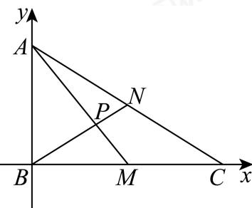

> [!faq]- 2023-2024学年内蒙古包头高一下学期期末数学试卷解析
>
> > [!success]- **【答案】** C
>
> > [!note]- **【分析】**
> > 建立平面直角坐标系，利用坐标法求得 $\langle \overrightarrow{PM},\overrightarrow{PN}\rangle$ 的余弦值.
>
> > [!note]- **【解析】**
> > 在△ $ABC$ 中， $AB = 2,AC = 4,\angle BAC = 60^{\circ}$ ，由余弦定理得 $BC = \sqrt{4 + 16 - 2\times 2\times 4\times\cos 60^{\circ}} = 2\sqrt{3},$ 则 $AB^{2} + BC^{2} = AC^{2}$ ，△ $ABC$ 为直角三角形，且∠ABC=90°，以B为原点，建立如图所示的平面直角坐标系：
> >
> > 
> >
> > 则 $A(0,2),C(2\sqrt{3},0),M(\sqrt{3},0),N(\sqrt{3},1)$ $\overrightarrow{AM} = (\sqrt{3}, - 2),\overrightarrow{BN} = (\sqrt{3},1)$ 所以 $\cos \langle \overrightarrow{PM},\overrightarrow{PN}\rangle = \cos \langle \overrightarrow{AM},\overrightarrow{BN}\rangle = \frac{\overrightarrow{AM}\cdot\overrightarrow{BN}}{|\overrightarrow{AM}||\overrightarrow{BN}|} = \frac{1}{\sqrt{7}\cdot 2} = \frac{\sqrt{7}}{14}.$ 故选：C
